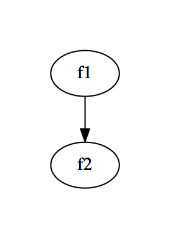
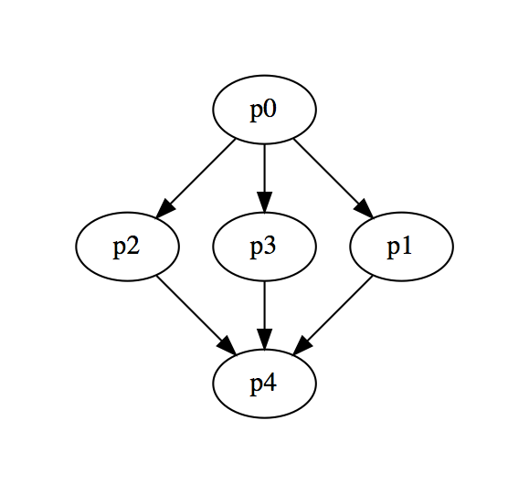

# Précepte core

The core module contains all the basic features.

## Prerequisites

Using Précepte is not different from using a `Future` or any other monadic data type.
You should understand the concepts of `Monad`, `Functor` and `Applicative`, and be familiar with Scalaz.

## From Future to Précepte

A Précepte is always parameterized by a type `F` representing the effect.
most of this documentation is using `Future`, since it's familiar to most Scala developers.

Let's say you've written the following code:


```scala
import scala.concurrent.Future
import scala.concurrent.ExecutionContext.Implicits.global

def f1: Future[Int] = Future.successful(42)
def f2(s: Int): Future[String] = Future.successful(s"The answer to life the universe and everything is $s")
```

If you were to "chain" the calls to f1 and f2, that is call f1 and feed it's return to f2, you'd be writing something like:

```scala
val ultimateAnswer: Future[String] =
  for {
    s <- f1
    i <- f2(s)
  } yield i
```

Let's define a simple await function to test our code:

```scala
import scala.concurrent.Await
import scala.concurrent.duration._
def await[A](f: Future[A]) = Await.result(f, 10 seconds)
```

Now we can test it:

```scala
scala> await(ultimateAnswer)
res1: String = The answer to life the universe and everything is 42
```


All is well, but you'd really like to be able to collect insights on your code, like how fast it is. Of course you choose to use Précepte for that!

Let's rewrite you code to use Précepte, and attach some metadata to it.

```scala
import scala.concurrent.Future
import scala.concurrent.ExecutionContext.Implicits.global

import com.mfglabs.precepte._
import corescalaz._
import default._

type Pre[A] = DPre[Future, Unit, A]
object Demo extends Category("demo") {
  def apply[A](f: ST[Unit] => Future[A])(implicit c: Callee) =
    Pre(BaseTags(c, Demo))(f)
}

import Macros.callee

def f1: Pre[Int] =
  Demo { st =>
    Future.successful(42)
  }

def f2(s: Int): Pre[String] =
  Demo { st =>
    Future.successful(s"The answer to life the universe and everything is $s")
  }
```

What we've done so far is not particularly exiting. We wrapped everything in a Précepte, and added metadata: the name of the current method, and their "categories". A category is just a group or layer of things in your code. It could be "Database" for all the methods accessing a Database, or "WS" for the methods calling a webservice, or anything you like.

One interesting point is that, at call site, apart from the return type, everything stays identical to our old `Future` version (pun totally intended).

```scala
val ultimateAnswerPre: Pre[String] =
  for {
    s <- f1
    i <- f2(s)
  } yield i
```

### The state

You probably have noticed a little `st` parameter sneaked into our code. This `st` is the current state. By default, Précepte will add the interesting metadata it collected in that state (Category, function name, ...). You can also use Précepte to carry a "custom" state.
The type of the custom state is fixed in our type definition for Pre. We said it was Unit.

Now if we want to run our code, we need to provide an initial state. Précepte will also ask you to provide information about the environment in which our application is executing.

```scala
val env = BaseEnv(Host("localhost"), Environment.Dev, Version("1.0-DEMO"))
val nostate = ST(Span.gen, env, Vector.empty, ())

implicit val unitSG = new scalaz.Semigroup[Unit] {
  def append(f1: Unit, f2: => Unit) = ()
}

import scalaz.std.scalaFuture._
```

// TODO: explain semigroup

Ok so we've added a bit of code, and finally, we're able to test the execution:

```scala
scala> val eventuallyUltimateAnswer = ultimateAnswerPre.eval(nostate)
eventuallyUltimateAnswer: scala.concurrent.Future[String] = scala.concurrent.impl.Promise$DefaultPromise@7abaeaf3

scala> await(eventuallyUltimateAnswer)
res9: String = The answer to life the universe and everything is 42
```

// TODO: Précepte and the State Monad

### Error handling

TODO

## Contextualized logs

Now that you have access to metadata about the executing code, you can do pretty interesting things, like hava contextualized logs.
Précepte has a module to use Logback. all you have to to is add it into your `build.sbt` file.

```scala
libraryDependencies += "com.mfglabs" %% "precepte-logback" % precepteVersion
```

Once you have that, you can start using you contextualized Logger :)

```scala
val logback = Logback(env, "demo-logger")

object WithLogger extends Category("demo") {
  def apply[A](f: logback.Logger => Future[A])(implicit c: Callee) = {
    val withLogger = (st: ST[Unit]) => f(logback.Logger(st.managed.span, st.managed.path))
    Pre(BaseTags(c, Demo))(withLogger)
  }
}

import Macros.callee

def f1: Pre[Int] =
  WithLogger { logger =>
    logger.info("Computing a value")
    Future.successful(42)
  }

def f2(s: Int): Pre[String] =
  WithLogger { logger =>
    println("prout")
    logger.info("Performing string concatenation!", Macros.param(s))
    Future.successful(s"The answer to life the universe and everything is $s")
  }

val ultimateAnswerPre: Pre[String] =
  for {
    s <- f1
    i <- f2(s)
  } yield i
```

And now when we run the code:

```scala
val ultimateAnswer = ultimateAnswerPre.eval(nostate)
await(ultimateAnswer)
```

Assuming logback is configured properly (see [the example logback.xml](../precepte-tut/src/main/resources/logback.xml)), the following should appear in your console:

```json
{
  "@timestamp": "2015-11-13T16:29:47.656+01:00",
  "@version": 1,
  "message": "Computing a value",
  "logger_name": "application",
  "thread_name": "run-main-11",
  "level": "INFO",
  "level_value": 20000,
  "HOSTNAME": "Juliens-MacBook-Pro.local",
  "span": "c8e9b61b-cf7c-4272-85da-7c320effb037",
  "callees": "/f1",
  "path": "/3_0",
  "environment": "dev",
  "parameters": {}
}
{
  "@timestamp": "2015-11-13T16:29:47.717+01:00",
  "@version": 1,
  "message": "Performing string concatenation!",
  "logger_name": "application",
  "thread_name": "ForkJoinPool-1-worker-13",
  "level": "INFO",
  "level_value": 20000,
  "HOSTNAME": "Juliens-MacBook-Pro.local",
  "span": "c8e9b61b-cf7c-4272-85da-7c320effb037",
  "callees": "/f1/f2",
  "path": "/3_0/4_0",
  "environment": "dev",
  "parameters": {
    "s": "42"
  }
}
```

## Graph it!

Précepte basically turn your code into a algebra, and an interpreter.
It's very easy to change the runtime a bit in order to alter the semantics of a program.
One application of this simple but powerful idea is built-in into Précepte.
You can very easily generate an execution graph of your program:

```scala
  val ultimateAnswerWithExecutionGraph = ultimateAnswerPre.graph(Graph.empty).eval(nostate)
  val (graph, result) = await(ultimateAnswerWithExecutionGraph)
```

The graph can then easily be turned into a graphviz representation:

```scala
scala> graph.viz
res16: String =
"
digraph G {
  "f1_5_0" [label = "f1"]
  "f2_6_0" [label = "f2"]
  "f1_5_0" -> "f2_6_0"
}
  "
```

Which once rendered looks like this:



And indeed in our code, we call f1 and then f2. Let's try this with a slightly more complex example.
Let's start by defining a bunch of async computations:

```scala
def p0 = Demo(s => Future(0 -> 0))
def p1 = Demo(s => Future(1 -> 1))
def p2 = Demo(s => Future(2 -> 2))
def p3 = Demo(s => Future(3 -> 3))
def p4 = Demo(s => Future(4 -> 4))
```

We can now built a more realistic example than the previous, mixing sequential and parallel effects using monads and applicative functors:

```scala
import scalaz.syntax.applicative._
val ptest =
      for {
        _ <- p0
        _ <- (p1 |@| p2 |@| p3).tupled
        _ <- p4
      } yield ()
  val (demoGraph, _) = await(ptest.graph(Graph.empty).eval(nostate))
```

```scala
scala> demoGraph.viz
res17: String =
"
digraph G {
  "p2_9_4" [label = "p2"]
  "p3_8_1" [label = "p3"]
  "p0_7_0" [label = "p0"]
  "p4_11_0" [label = "p4"]
  "p1_10_6" [label = "p1"]
  "p0_7_0" -> "p2_9_4"
  "p0_7_0" -> "p3_8_1"
  "p1_10_6" -> "p4_11_0"
  "p3_8_1" -> "p4_11_0"
  "p2_9_4" -> "p4_11_0"
  "p0_7_0" -> "p1_10_6"
}
  "
```

And again rendering this nice little graph :)




## Monitoring with InfluxDB and Grafana

## Précepte and the Free monad.
